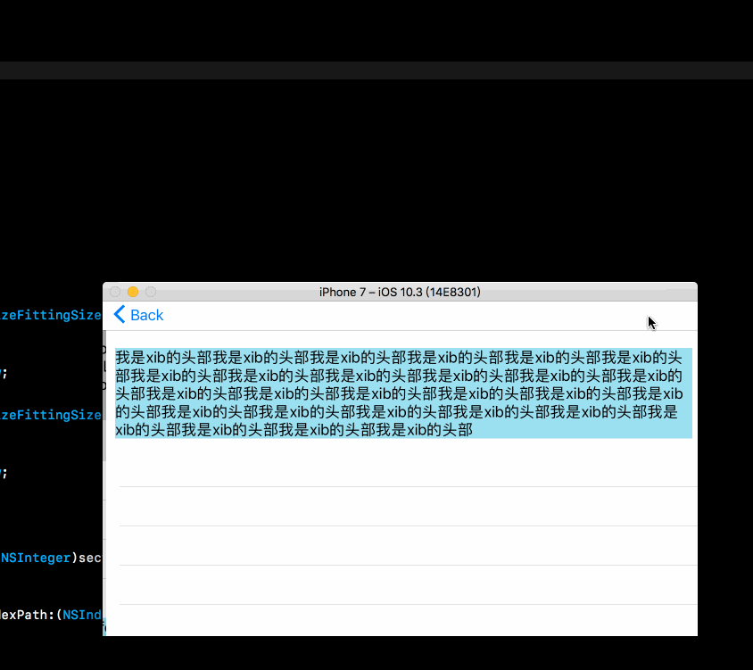

# SB-Xib-TableView-HeaderView-FooterView
>本项目主要是介绍在`SB`/`Xib`中给`UITableView`设置`tableHeaderView`，`tableFooterView`的方法。默认认为已经基本熟悉`SB`/`Xib`的使用哈。

>在平时的项目开发中，可能使用sb或者xib会特别快，当然喜欢代码的就可以忽略了哈。我们在用UITableView可能会使用到`tableHeaderView`，`tableFooterView`这2个属性，在有一些需求来说是得心应手。之前都是使用代码添加UITableView的`tableHeaderView`，`tableFooterView`，虽然也挺方便，那么是否可以使用xib直接添加呢？在网上搜了下，答案是可以的哈，下面的简单介绍下添加的方式。

## Storyboard 中给`UITableView`设置`tableHeaderView`，`tableFooterView`

## Xib 中给`UITableView`设置`tableHeaderView`，`tableFooterView`

## 运行结果

## 参考
- [在Storyboard中为UITableView添加Header和Footer](http://jerrytian.com/2016/03/05/%E5%9C%A8Storyboard%E4%B8%AD%E4%B8%BAUITableView%E6%B7%BB%E5%8A%A0Header%E5%92%8CFooter/)
- [关于SB中的TableView和XIB中的TableView](http://www.jianshu.com/p/07f7a7ae236c)